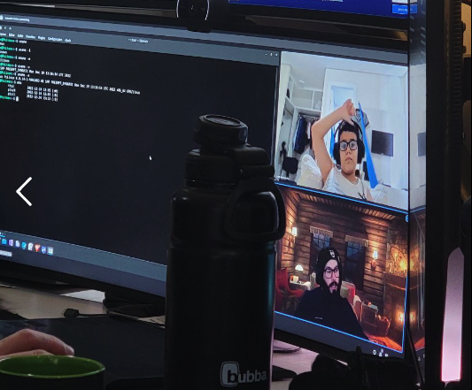

<!-- PROJECT LOGO -->
<br />
<div align="center">
  <a href="https://github.com/kalib/estudosjoao">
    
  </a>

  <h3 align="center">Estudos João</h3>

  <p align="center">
    Um repositório para os estudos do João
    <br />
    <a href="https://github.com/kalib/estudosjoao"><strong>Explore os documentos »</strong></a>
    <br />
    <br />
    <a href="https://github.com/kalib/estudosjoao/issues">Reportar Bug</a>
    ·
    <a href="https://github.com/kalib/estudosjoao/issues">Solicitar Mudança</a>
  </p>
</div>


<!-- TABLE OF CONTENTS -->
<details>
  <summary>Conteúdo</summary>
  <ol>
    <li>
      <a href="#sobre-o-projeto">Sobre o Projeto</a>
      <ul>
        <li><a href="#tecnologias">Tecnologias</a></li>
      </ul>
    </li>
    <li>
      <a href="#inicio">Início</a>
      <ul>
        <li><a href="#requisitos">Requisitos</a></li>
        <li><a href="#configuracao">Configuração</a></li>
      </ul>
    </li>
    <li><a href="#uso">Uso</a></li>
    <li><a href="#linha-do-tempo">Linha do Tempo</a></li>
  </ol>
</details>


<!-- ABOUT THE PROJECT -->
## Sobre o Projeto

Este reposiório servirá de centralizador para os estudos do João.

A ideia é centralizarmos os estudos, arquivos de anotações, exercícios e material de estudo em geral.


### Tecnologias

Aqui estará a lista de tecnologias utilizadas até agora nos estudos.
Badges retirados de: https://github.com/Ileriayo/markdown-badges

* 
* 
* 
* 
* 
* 
* 


<!-- GETTING STARTED -->
## Início

Conforme avancemos com os estudos, listaremos aqui intruções de o que é preciso configurar ou instalar.

### Requisitos

Lista de requisitos para os estudos:

* chave ssh
  ```sh
  ssh-keygen
  ```

* vim
  ```sh
  sudo apt install vim
  ```

* vscode
  ```sh
  sudo apt install code
  ```

* git
  ```sh
  sudo apt install git
  ```

### Configuração

#### Git

Por enquanto temos apenas um repositório no Github, chamado **estudosjoao**.

* Clone o repositório:
  ```sh
  mkdir ~/repos
  cd ~/repos
  git clone git@github.com:kalib/estudosjoao.git
  ```

* Configure seu nome e email no repositório:
  ```sh
  git config --global user.email <seu_email>
  git config --global user.nome <seu_nome>
  ```

#### Github

A sua chave deverá ser inserida neste repositório para que tenha permissões de leitra/escrita.


<!-- Exemplos de Uso -->
## Uso

Ainda não temos nada aqui, mas teremos...


<!-- Linha do Tempo -->
## Linha do Tempo

- [x] Criar repositório
- [ ] Colocar primeiro arquivo de comandos - convertido para YAML
- [ ] Outras coisas
- [ ] Mais coisas ainda
    - [ ] algo
    - [ ] algo

Confira a página de bugs ou sugestões de melhorias [aqui](https://github.com/kalib/estudosjoao/issues) para uma lista completa e status de tudo o que está pendente.
